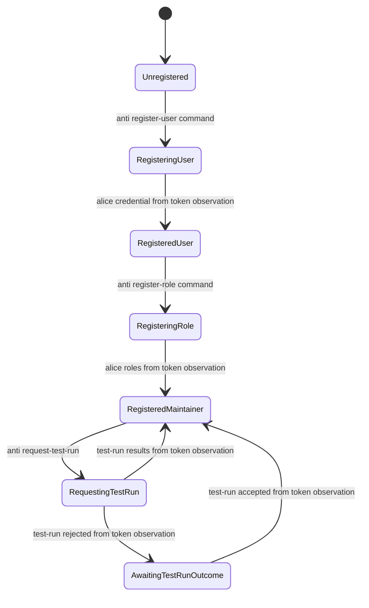
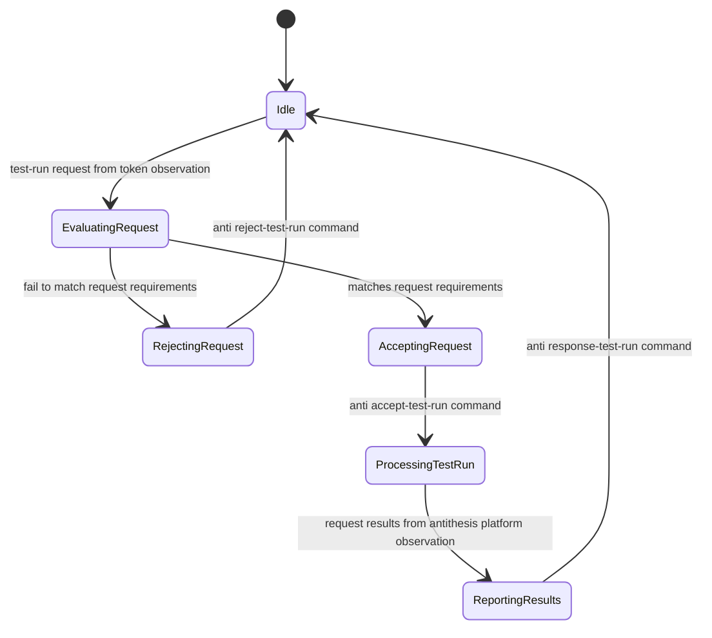
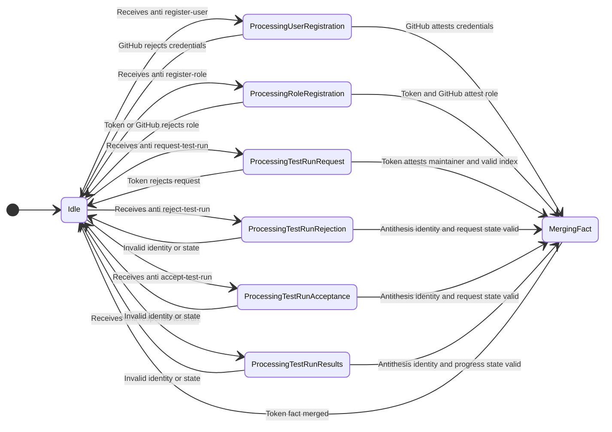
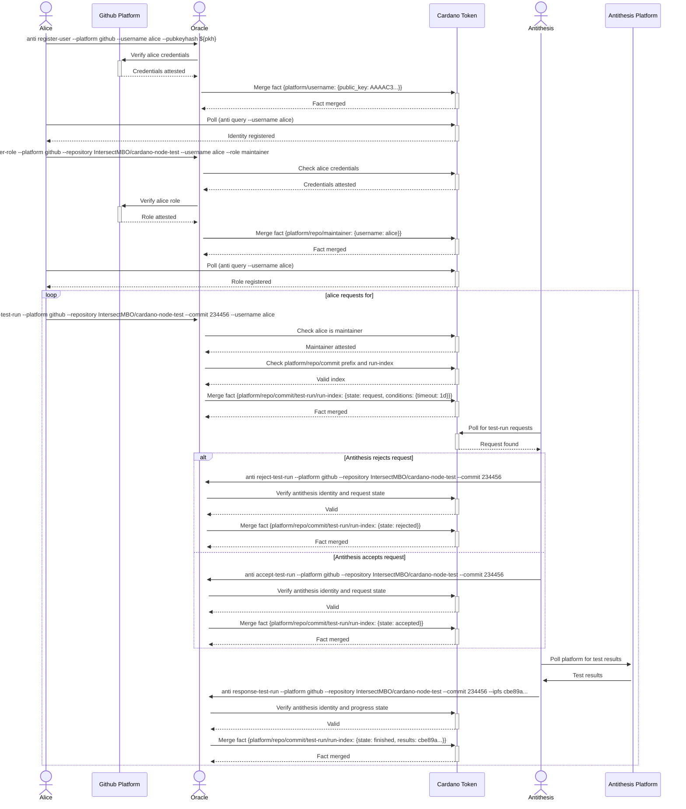

## Antithesis scenario

### Context
  * `alice` is a user who wants to run tests in Antithesis
     * `alice` github user holds a maintainer role in the repository `IntersectMBO/cardano-node-test`
     * `alice` has registered an ssh ed25519 pub key in her github profile
  * code to setup an Antithesis test lives in repository `IntersectMBO/cardano-node-test`
  * `antithesis` is an agent that controls and monitors test-run's on the antithesis platform
  * `token` is a stateful uninque token locked on-chain tracking the interactions between `alice` and `antithesis`. As a side effect it tracks also alice github credentials and alice github roles. It's a fact container, with a smart contract controlling the update process of the facts.
  * `oracle` is an agent in charge of the `token` updates. It does everything in its power to prevent inconsistent data to enter/exit the `token`.

### Alice state journey

### Antithesis agent state journey

### Oracle state journey

### Workflow

