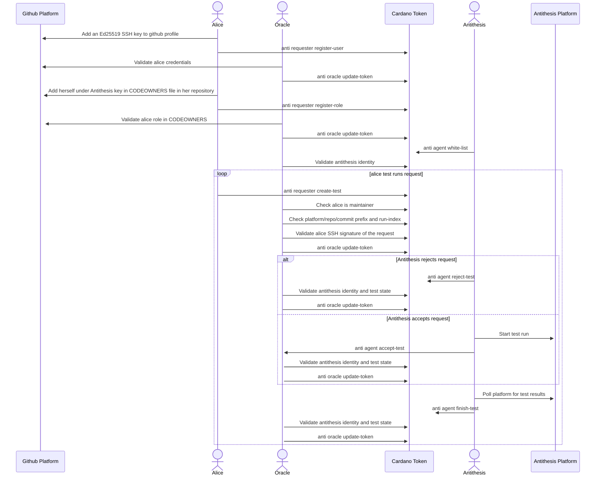

# Antithesis Interface

## Context
  * `alice` is a user who wants to run tests in Antithesis for her cardano-node
  * `antithesis` is an agent that controls and monitors test-run's on the antithesis platform
  * `token` is a stateful unique token locked on-chain tracking the interactions between `alice` and `antithesis`. As a side effect it tracks also alice github credentials and alice github roles. It's a fact container, with a smart contract controlling the update process of the facts.
  * `oracle` is an agent in charge of the `token` updates. It does everything in its power to prevent inconsistent data to enter/exit the `token`.

## Sequence Diagram

